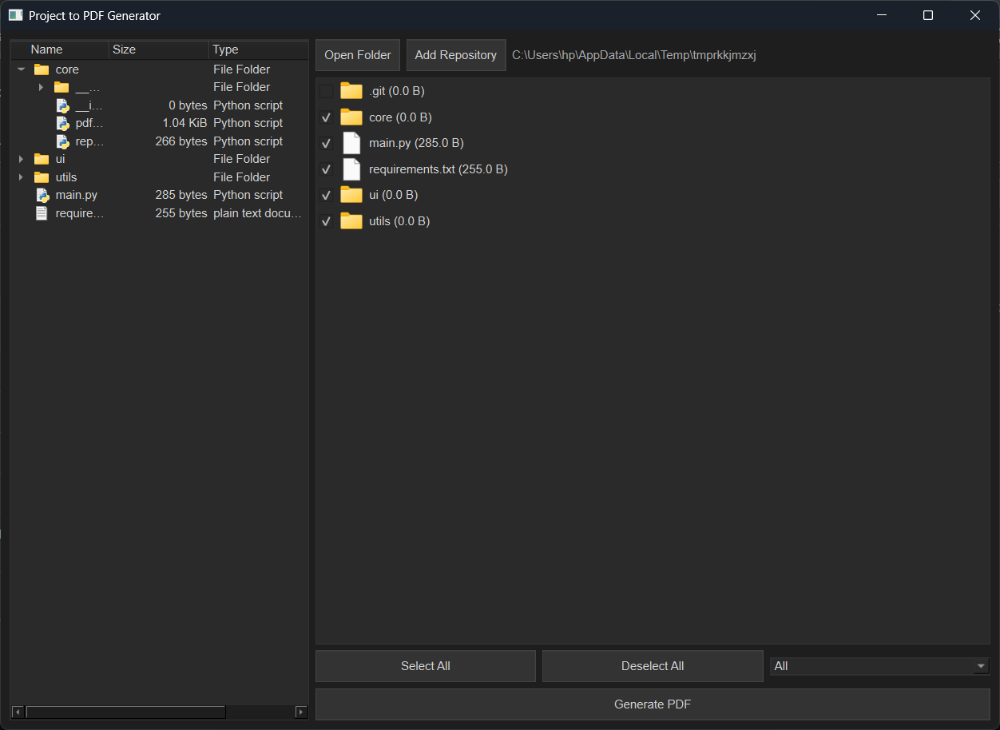

# 🗂️ Project to PDF Generator 📄✨

[](https://your-build-system.com/your-project)
[](https://www.python.org/downloads/)
[](https://opensource.org/licenses/MIT)
<!-- Add other relevant badges here, e.g., code coverage, static analysis -->

Tired of manually copying and pasting your code into documents? 😩 Wish there was a quick and easy way to share your project's structure and source code? 🤔 Look no further! This handy desktop application, built with the power of PyQt6 and reportlab, lets you magically ✨ transform your projects into beautiful, organized PDFs!

This tool allows you to select a local project folder (or even clone a Git repository! 🤯), browse its contents with an intuitive interface, pick and choose the files and folders you want, and *poof* 🪄—generate a comprehensive PDF document.  It's perfect for creating documentation, sharing code snippets, or archiving project snapshots.

## Features  🌟

This project is packed with features to make your life easier:

*   **📁 Folder & Git Repo Friendly:**
    *   Open local project folders with a simple file dialog.
    *   Clone remote Git repositories directly by pasting their URL! 🚀
    *   Drag and drop folders *or* Git repo URLs onto the application.  So easy!
*   **🌳 Interactive Browsing:**
    *   Explore your project's structure with a hierarchical tree view (like a file explorer, but better!).
    *   See the contents of each folder in a clear list view.
    *   Cute file and folder icons! 📂📄
    *   File sizes are displayed right there in the list. No more guessing!
    *   Hidden files/folders (starting with a dot) are grayed out, so you know what's what.
*   **✅ Selective Inclusion:**
    *   Checkboxes let you easily select or deselect individual files or entire folders.
    *   "Select All" and "Deselect All" buttons for super-speedy selection. ⚡
    *   Deselecting a parent folder *automatically* deselects its children. Smart, right? 😉
    *   Filter files by extension (.py, .txt, .md, or show everything!).
*   **📄 PDF Power!**
    *   Generates a polished PDF document containing:
        *   A clean, textual tree diagram of your project's structure.
        *   The actual source code of your selected files, nicely formatted.
        *   Handles those pesky file reading errors gracefully.
        *   Clear file headers in the PDF, so everything is organized.
        *   Full Unicode (UTF-8) support.  No more weird character issues!
*   **🖥️ User-Friendly UI:**
    *   A modern, clean interface using PyQt6's Fusion style, with a dark theme that's easy on the eyes. 😎
    *   A "Back" button to navigate through your folder history (within the project).
    *   A status bar shows you exactly where you are in your project.
    *   Helpful error messages and warnings, just in case.
* **Token Count Calculation (Experimental)**
    * Uses the `tiktoken` library with the "cl100k_base" encoding (commonly used by OpenAI) to estimate the token count of selected files. *Note: This feature is experimental and primarily prints the token count to the console; it's not integrated into the PDF output.*
* **Cross-Platform:**  Works on Windows, macOS, and Linux! 🎉

## Screenshot 🖼️

Here's a sneak peek at the application in action:



## Installation 🛠️

Getting started is a breeze!

1.  **Prerequisites:**

    *   Python 3.7 or higher.  (Get it from [python.org](https://www.python.org/downloads/))
    *   Git (if you want to clone repositories).

2.  **Clone the repository (or download the code):**

    ```bash
    git clone https://github.com/Vinitrajputt/repoChat
    cd repoChat
    ```

3.  **Install dependencies:**

    It's *highly* recommended to use a virtual environment (it keeps things tidy!):

    ```bash
    python3 -m venv venv
    source venv/bin/activate  # On Windows: venv\Scripts\activate
    ```

    Then, install the goodies:

    ```bash
    pip install -r requirements.txt
    ```

    The `requirements.txt` file lists these packages:

    ```
    PyQt6
    reportlab
    gitpython
    tiktoken
    ```

## Usage 🚀

Ready to generate some PDFs?

1.  **Run the application:**

    ```bash
    python main.py
    ```

2.  **Open a Project Folder:**

    *   Click "Open Folder" and choose your project. *Or,*
    *   Drag and drop your project folder onto the app window.

3.  **Add a Git Repository:**

    *   Click "Add Repository" and paste the URL. *Or,*
    *   Drag and drop the repo URL.

4.  **Browse and Select:**

    *   Use the tree view (sidebar) to explore.
    *   Use the list view to see files and folders.
    *   Check the boxes next to what you want in the PDF.

5.  **Filter (Optional):**

    *   Use the dropdown to filter by file extension.

6.  **Generate!**

    *   Click "Generate PDF".
    *   Pick a name and location to save your masterpiece.

7.  **Go Back:**
    *   Click "Back" to revisit previous folders (within the current project; it's all handled in the `MainWindow` class).

## Project Structure 🏗️

Here's how the project's files are organized:

```
project_root/
├── core/
│   ├── pdf_generator.py     # PDF creation magic 
│   └── repo_handler.py      # Git repo cloning 
├── ui/
│   ├── main_window.py      # Main app window
│   └── widgets.py          # Custom PyQt widgets (like FileListWidget) 
├── utils/
│   └── helpers.py          # Utility functions 
├── main.py                 # main script 
├── requirements.txt       # List of required packages 
└── README.md               # This very file! 
└── screenshots/           # Where screenshots live 
```

*   **`core`:** The heart of the application: PDF generation and repo handling.
*   **`ui`:**  Everything related to the user interface.
*   **`utils`:**  Helpful little functions.
*   **`main.py`:**  main script.
*   **`requirements.txt`**:  The list of Python packages you need.
* **`screenshots`**: where the image is stored.

## Contributing 🤝

Want to help make this project even better?  Contributions are welcome!

*   Found a bug? 🐛  Open an issue!
*   Have a feature suggestion? 💡 Open an issue!
*   Want to write some code? Fork the repo and submit a pull request!

## License 📝

This project is licensed under the MIT License - see the [LICENSE](LICENSE) file for details.

## Future Improvements 🚀

Here are some ideas for making the app even *more* awesome:

*   **PDF Table of Contents:**  Make navigation even easier.
*   **Syntax Highlighting:**  Make the code in the PDF look *really* good.
*   **Customizable Styles:**  Let users choose fonts, colors, etc. for the PDF.
*   **Progress Bar:**  Show progress during PDF generation (especially for big projects).
*   **Asynchronous Operations:**  Keep the UI responsive, even during long tasks.
*   **Better Error Handling:** Even more informative error messages.
*   **Configuration File:**  Save user preferences.
*   **Integrate Token Count into PDF:** Show token counts in the PDF itself.
*   **Test Suite:**  Write tests to keep the code robust.
